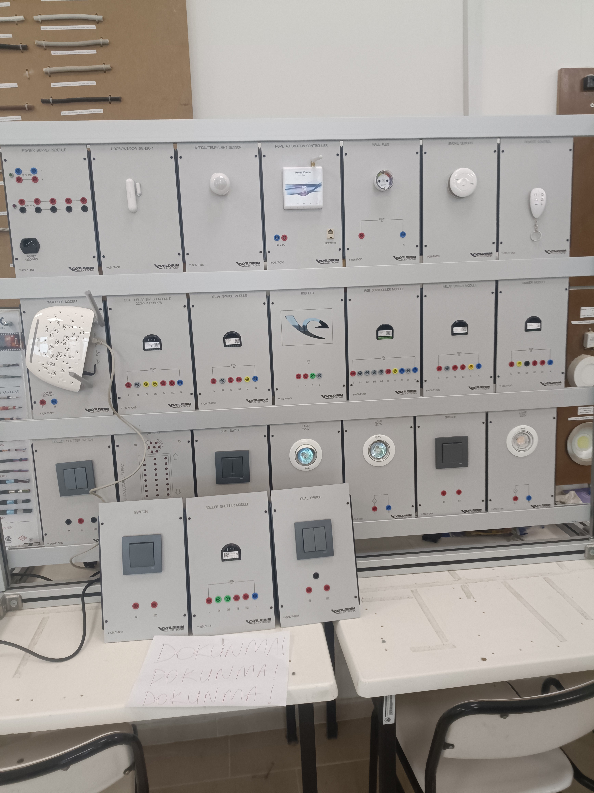
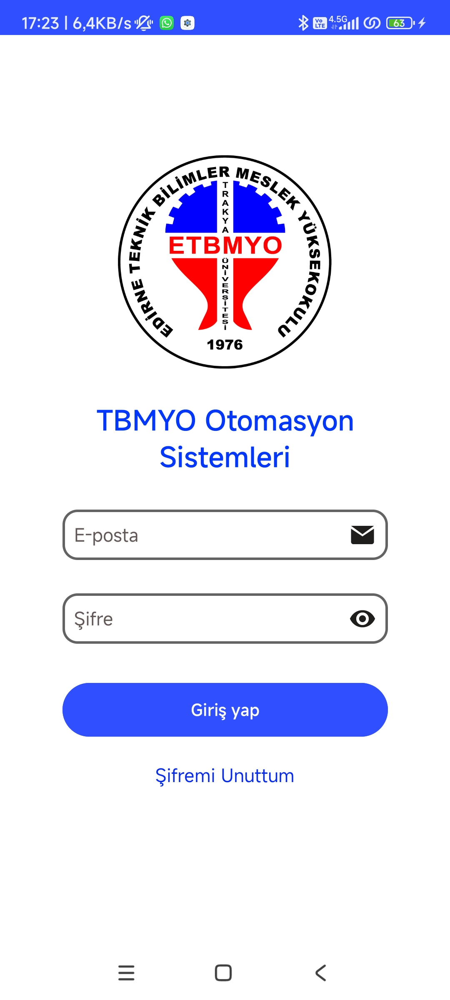
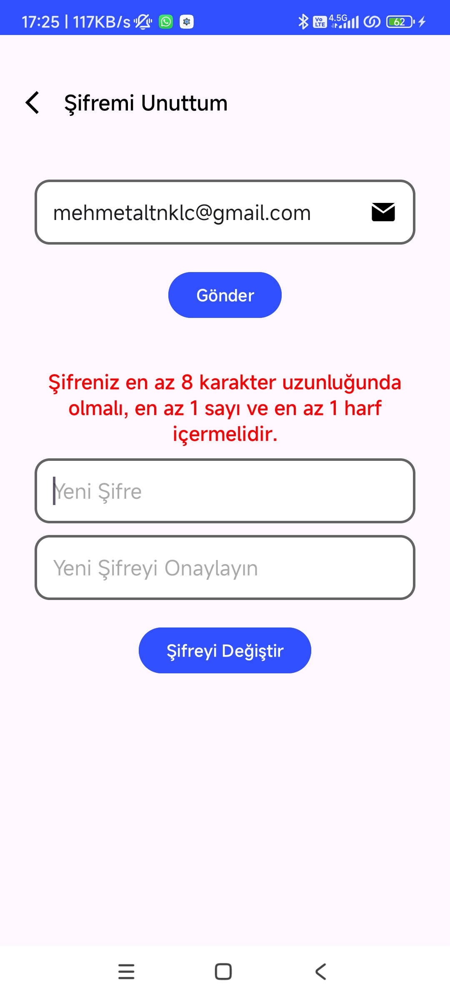
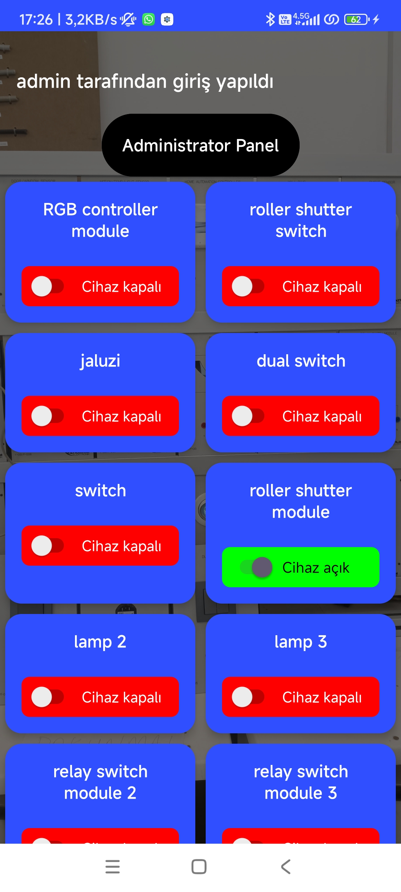
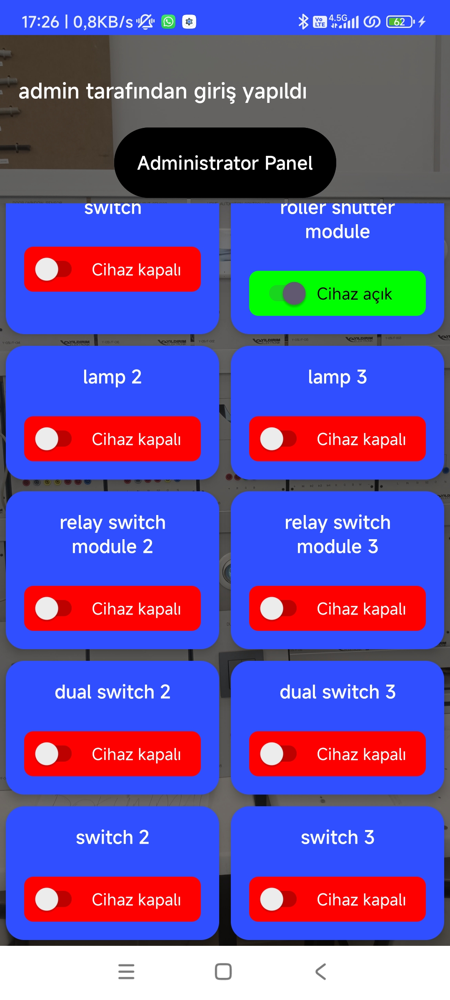
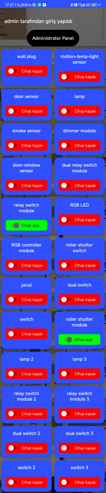
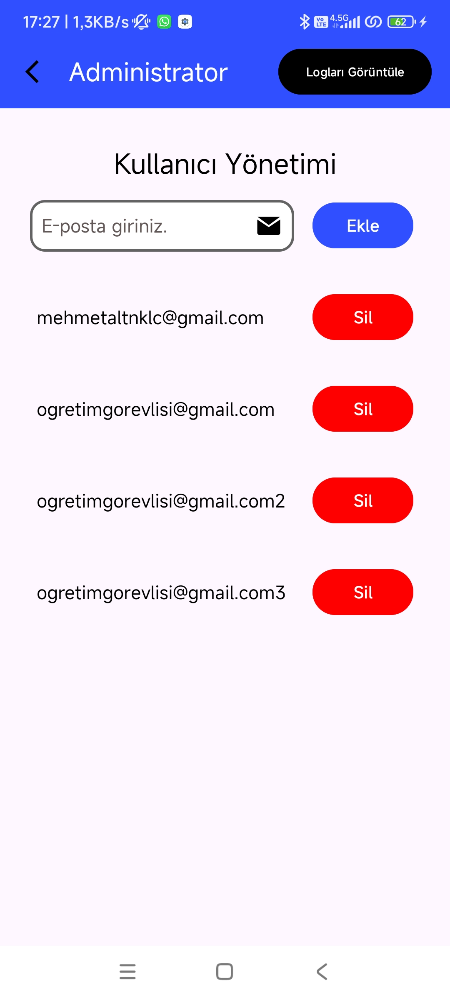
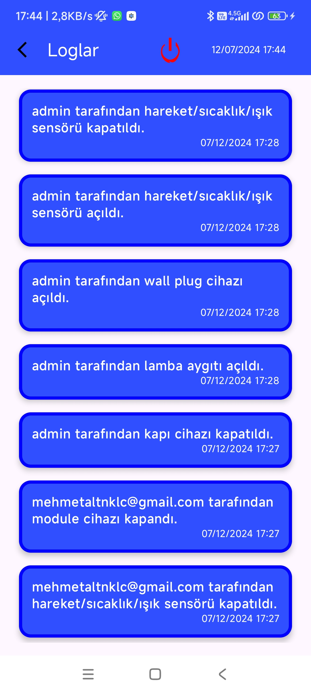
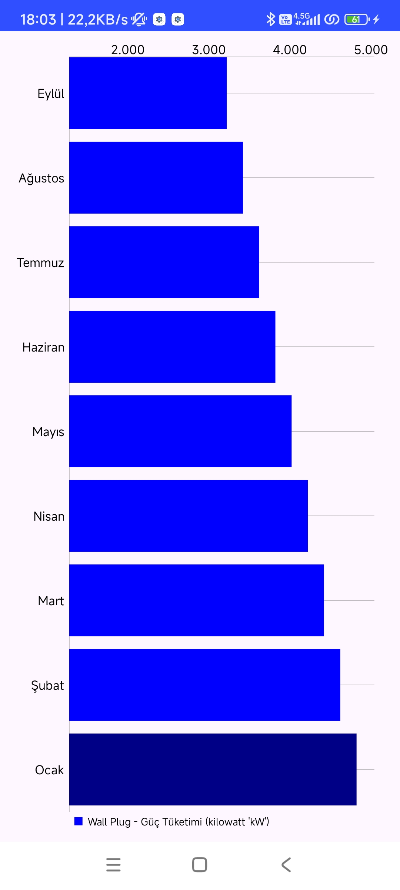

# Smart Building Automation System

The main goal of this project is to implement a smart building automation system by setting up the newly acquired building automation system kit for the Technical Sciences Vocational School. Additionally, an Android mobile application is developed to securely control the devices within the system. This application is designed to facilitate everyday life, enhance energy efficiency, maximize comfort, and ensure safety.

The automation system uses **Home Center Lite** as the central controller. Devices paired with the controller can be accessed over the internet, meaning users can control these devices remotely as long as there is an internet connection. **Home Center Lite** uses **Z-Wave communication technology**, which operates on radio frequencies, allowing signals to pass through walls and obstacles for broader coverage. **Z-Wave** also utilizes a **mesh network** structure, enabling devices to communicate with each other, even indirectly. For example, if a device cannot directly reach the controller, it can transmit the signal through other Z-Wave devices. **Z-Wave** uses **AES-128 encryption**, ensuring secure data transmission.

---

## 📋 Features Overview

### Core Features
- **Secure Authentication & Role-Based Access Control (RBAC)**
  - Secure login using **JWT-based token authentication**.
  - Passwords are securely stored using **Bcrypt** hashing.
  - **Two user roles**:
    - **Administrator**: Full access including user management, logs, and device control.
    - **User**: Limited access for controlling devices and viewing logs.

- **Device Control**
  - Remotely manage Z-Wave-enabled devices via a mobile app.
  - Real-time device status monitoring and control.

- **Admin Management**
  - Add, delete, and manage user accounts through a dedicated admin panel.
  - Full access to system logs and configurations.

- **Activity Logs**
  - Detailed records of device activities, including user actions and timestamps, ensuring full transparency.

- **Power Consumption Monitoring**
  - Real-time graphical representation of power consumption for all connected devices.

---

## 🖼️ Screenshots
The `Assets/` folder contains all the visual assets that showcase the app’s UI and key functionalities. The images are displayed in a **4x3 grid layout** for better clarity. Each image is set to a width of 200 pixels to ensure a uniform and visually appealing presentation:

<table>
  <tr>
    <td></td>
    <td></td>
    <td></td>
    <td></td>
  </tr>
  <tr>
    <td></td>
    <td></td>
    <td></td>
    <td></td>
  </tr>
  <tr>
    <td></td>
    <td></td>
    <td></td>
    <td></td>
  </tr>
  <tr>
    <td></td>
    <td></td>
    <td></td>
    <td></td>
  </tr>
</table>

---

## 🚀 Getting Started

### Prerequisites
```bash
- Node.js installed on your machine.
- Android Studio for building and running the mobile application.
```

### Setup Steps
1. **Clone the repository**:

   ```bash
   git clone https://github.com/your-username/smart-building-automation.git
   cd smart-building-automation
   ```

2. **Backend Setup**:
   - Navigate to the `backend/` folder:

     ```bash
     cd backend
     npm install
     ```

   - Start the server:

     ```bash
     node app.js
     ```

3. **Frontend Setup**:
   - Open the `app/` folder in **Android Studio**.
   - Build and run the application on an emulator or connected device.

---

## 🌟 Future Enhancements
1. **Voice Control Integration**: Support for **Google Assistant** or **Amazon Alexa**.
2. **Additional IoT Protocols**: Expand compatibility to **Zigbee** and **MQTT**.
3. **Web-Based Admin Panel**: Develop a web interface for centralized management.
4. **Real-Time Notifications**: Push notifications for device activities.

---

## 📜 License
This project is licensed under the **MIT License**. See the [LICENSE](LICENSE) file for more details.
