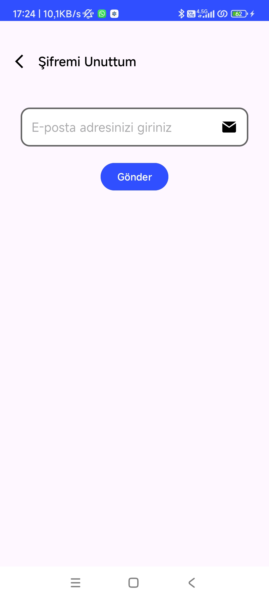

# Smart Building Automation System

This repository contains the full implementation of a **Smart Building Automation System**, developed to provide enhanced device control, energy management, and user convenience through a secure and user-friendly mobile application. The project combines IoT, mobile app development, and security best practices to deliver a reliable building automation solution.

---

## 📋 Features Overview

### Core Features
- **Secure Authentication & Role-Based Access Control (RBAC)**
  - Secure login using **JWT-based token authentication**.
  - Passwords are securely stored using **Bcrypt** hashing.
  - **Two user roles**:
    - **Administrator**: Full access including user management, logs, and device control.
    - **User**: Limited access for controlling devices and viewing logs.

- **Device Control**
  - Remotely manage Z-Wave-enabled devices via a mobile app.
  - Real-time device status monitoring and control.

- **Admin Management**
  - Add, delete, and manage user accounts through a dedicated admin panel.
  - Full access to system logs and configurations.

- **Activity Logs**
  - Detailed records of device activities, including user actions and timestamps, ensuring full transparency.

- **Power Consumption Monitoring**
  - Real-time graphical representation of power consumption for all connected devices.

---

## 🖼️ Screenshots
The `Assets/` folder contains all the visual assets that showcase the app’s UI and key functionalities:

1. **Test Panel and All Devices**  
     
   This image shows the physical setup of the automation system, including the control panel and devices.

2. **App Icon and Name**  
     
   Branding of the application, including the logo and app name.

3. **Login Screen**  
     
   User login screen featuring secure authentication with JWT.

4. **Forgot Password Flow**:  
   - **Forgot Password Screen**  
       
     Users can initiate a password reset by entering their email.  
   - **Reset Password Step 1**  
       
     The user receives a reset code via email to verify their identity.  
   - **Reset Password Step 2**  
       
     After verification, users can set a new password.

5. **Device Control Panel**:  
   - **Part 1**  
       
     The initial view of the device control panel, allowing users to turn devices on/off.  
   - **Part 2**  
       
     More devices appear here, expanding the scope of control.  
   - **Complete Device Control View**  
       
     A full view of all devices managed through the application.

6. **Admin Panel**  
     
   A dedicated screen for administrators to add/remove users and manage the system.

7. **Log Screen**  
     
   Activity logs detailing device usage, user interactions, and timestamps.

8. **Power Consumption Screen**  
     
   Graphical view showing power consumption of various devices.

---

## 🛠️ Technical Architecture

### Backend
- **Node.js** with **Express.js** for server-side development.
- **JWT** for user authentication and access management.
- **Bcrypt** for hashing passwords to ensure data security.

### Frontend
- Developed using **Android Studio** with **Kotlin**.
- Single-activity, multi-fragment architecture for better modularity.

### Communication Protocol
- **Z-Wave Technology** for seamless communication:
  - Uses mesh networking for extended range.
  - **AES-128 encryption** ensures data transmission security.

### Security Measures
1. **JWT Authentication**: Ensures secure user authentication with token validation for each request.
2. **Password Hashing**: Passwords are stored using **Bcrypt** for enhanced security.
3. **ProGuard Obfuscation**: Protects the app against reverse engineering.
4. **Secure SharedPreferences**: Sensitive data like JWT tokens are stored encrypted on the device.

---

## 📂 Repository Structure

```
├── Assets/
│   ├── 0_Test_Panel_and_All_Devices.png
│   ├── 1_App_Icon_and_Name.png
│   ├── 2_Login_Screen.png
│   ├── 3.1_Forgot_Password_Screen.png
│   ├── 3.2_Reset_Password_Step.png
│   ├── 3.3_Reset_Password_Step_2.png
│   ├── 4.1_Device_Control_Part_1.png
│   ├── 4.2_Device_Control_Part_2.png
│   ├── 4.3_Device_Control_Complete.png
│   ├── 5_Admin_Panel.png
│   ├── 6_Log_Screen.png
│   ├── 7_Power_Consumption_Screen.png
├── app/
│   ├── [Android application source code]
├── backend/
│   ├── [Node.js backend code]
├── docs/
│   ├── [Documentation files]
└── README.md
```

---

## 🚀 Getting Started

### Prerequisites
- **Node.js** installed on your machine.
- **Android Studio** for building and running the mobile application.

### Setup Steps
1. Clone the repository:
   ```bash
   git clone https://github.com/your-username/smart-building-automation.git
   cd smart-building-automation
   ```

2. **Backend Setup**:
   - Navigate to the `backend/` folder:
     ```bash
     cd backend
     npm install
     ```
   - Start the server:
     ```bash
     node app.js
     ```

3. **Frontend Setup**:
   - Open the `app/` folder in **Android Studio**.
   - Build and run the application on an emulator or connected device.

---

## 🌟 Future Enhancements
1. **Voice Control Integration**: Support for **Google Assistant** or **Amazon Alexa**.
2. **Additional IoT Protocols**: Expand compatibility to **Zigbee** and **MQTT**.
3. **Web-Based Admin Panel**: Develop a web interface for centralized management.
4. **Real-Time Notifications**: Push notifications for device activities.

---


## 📝 License
This project is licensed under the **MIT License**. See the [LICENSE](LICENSE) file for more details.
